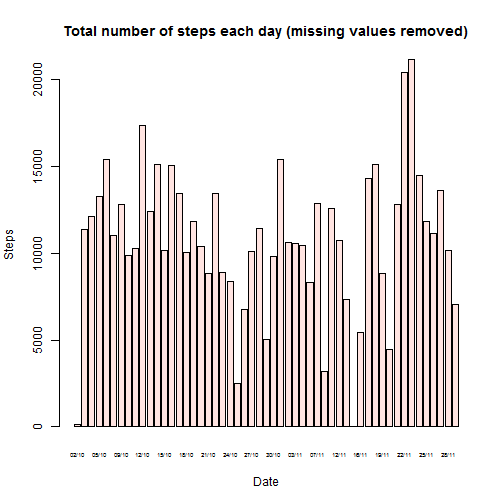

## What is mean total number of steps taken per day?

 

The mean total is 10766.2.  The median total is 10765.

---

## What is the average daily activity pattern?

 

Interval 835 on average across all the days in the dataset, contains the maximum number of steps.

---

## Inputing missing values

The total number of rows with 'NA's is 2304.

 

The mean total is 10766.2.  The median total is 10766.2.

As the NA replacement algorithm substituted the interval mean, the mean total has not changed but the median total has.

---

## Are there differences in activity patterns between weekdays and weekends?

 

